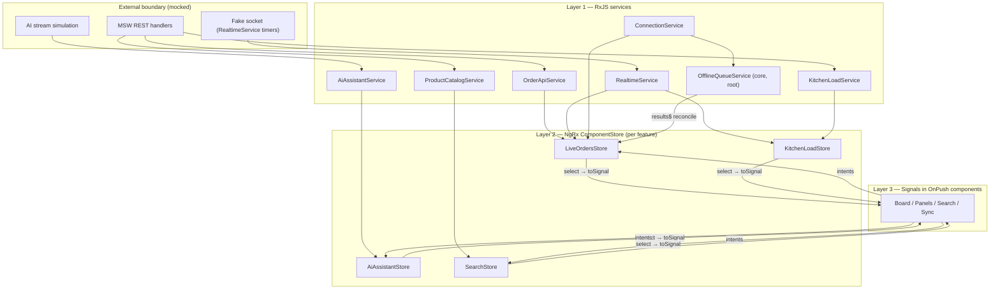
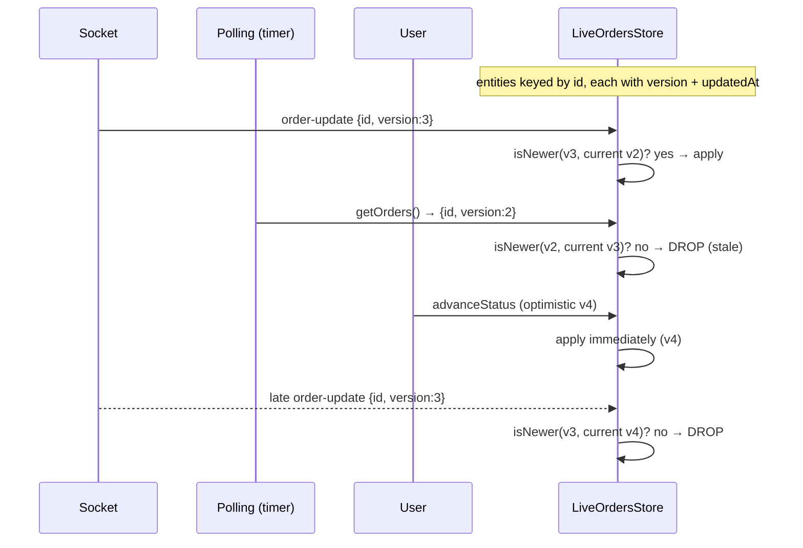
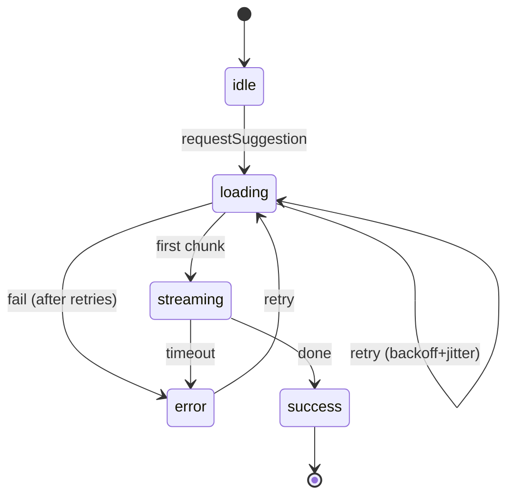
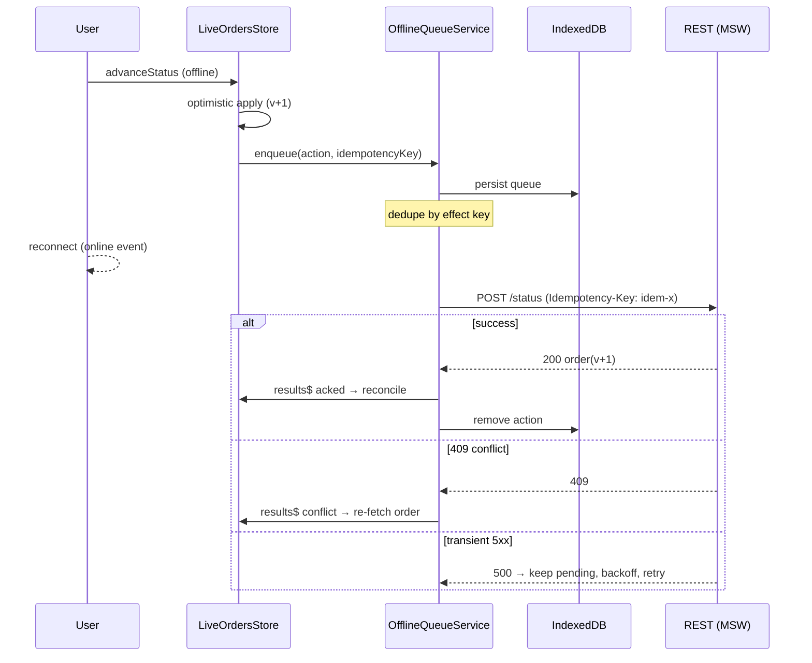

# Architecture

Detailed diagrams and data-flow walkthroughs for the Smart Order Workspace.
Diagrams use Mermaid (rendered by GitHub) with ASCII fallbacks in prose.

## 1. Layered overview



## 2. Order reconciliation (three sources → one truth)

The board's single source of truth is the `LiveOrdersStore` entity map. Three
independent producers feed it; every write passes through `isNewer()`:



`isNewer` compares `version` first (authoritative, monotonic) and falls back to
`updatedAt`. This is what prevents flicker and status regressions when a slow
poll or a late socket event races an optimistic change.

## 3. AI suggestion state machine



Concurrency: requests are `groupBy(orderId:type)` then `exhaustMap`, so a panel
can't double-fire its own stream while different orders/types stream in parallel.
Cancellation is a `takeUntil(cancel$)` per key, plus whole-store teardown on route
change (ComponentStore `ngOnDestroy`).

## 4. Offline optimistic action + replay



Replay is FIFO and single-flight (guarded), survives reload (rehydrated from
IndexedDB, resetting any mid-flight `syncing` state), and is replay-safe because
the server dedupes on the `Idempotency-Key`.

## 5. Search cancellation pipeline

```
keystrokes ──▶ debounceTime(250) ──▶ distinctUntilChanged ──▶ switchMap(fetch)
                                                                   │
                       new keystroke cancels the in-flight fetch ◀─┘
```

A stale response whose request was superseded is discarded by `switchMap`, so it
can never overwrite fresher results. Results render through a CDK virtual-scroll
viewport, so only the visible rows exist in the DOM.

## 6. Injection tokens

- `MOCK_CONFIG` — latency, error rates, retry policy, socket/poll cadence. One
  place to tune the whole simulation; tests override it for determinism.
- `CLOCK` — injectable "now" so age/priority derivation and relative-time
  formatting are deterministic under test.
